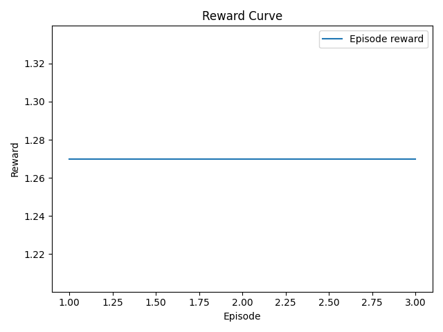
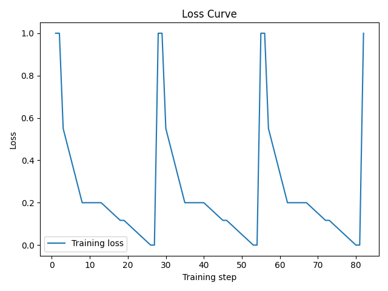
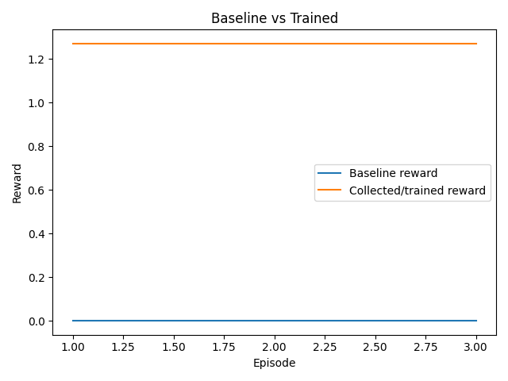

# Agentic Security Lab

**An RL environment where LLMs learn to contain software supply-chain attacks under deadline pressure.**

Every day, malicious packages show up on npm and PyPI. When one hits your dependency tree, a security engineer has maybe 15 minutes to figure out what's compromised, quarantine the right packages, rotate the right secrets, and notify every affected team — before the attacker exfiltrates credentials.

LLMs can't do this well today. They struggle to prioritize under time pressure, miss transitive dependencies, forget to rotate secrets, and panic-quarantine clean packages. This environment exists to train that skill.

> **Space**: [A-HK/agentic-security-lab](https://huggingface.co/spaces/A-HK/agentic-security-lab)  
> **Notebook**: [notebooks/round2_training_colab.ipynb](notebooks/round2_training_colab.ipynb)  
> **Hackathon themes**: #2 Long-Horizon Planning, #3 World Modeling, #4 Self-Improvement

---

## What the agent sees and does

The agent starts with an incident alert and a list of packages in scope. It doesn't know which ones are malicious — it has to investigate. At each step it picks one action:

| Action | What it does | Reward |
|--------|-------------|--------|
| `scan_logs` | Search CI/CD logs for IOCs | +0.02 |
| `inspect_package` | Check publisher, publish date, IOC indicators | +0.01 |
| `check_dependents` | Find downstream teams affected | +0.01 |
| `quarantine` | Yank a malicious package from registry | +0.15 |
| `rotate_secret` | Revoke and regenerate a credential | +0.12 (critical) / +0.06 |
| `notify` | Send breach alert to affected team | +0.04 |
| `conclude` | End the episode | Bonus/penalty based on completeness |

Penalties exist for quarantining clean packages (−0.05), re-rotating secrets (−0.02), and invalid commands (−0.01). There's an attacker on a timer — if critical secrets aren't rotated before the exfiltration deadline, the attacker wins and the episode takes a −0.20 hit.

The benchmark score is deterministic:

```
score = 0.35 × quarantine_ratio + 0.35 × rotate_ratio + 0.20 × notify_ratio + 0.10 × contain_ratio
```

---

## Why RL, not just prompting

Three reasons this environment genuinely needs RL:

**1. Procedural scenario generation.** The environment doesn't have 3 fixed scenarios anymore — it generates unique incidents from parameterized distributions. Different packages, different attack vectors (typosquatting, dependency confusion, account takeover, protestware, backdoor injection, CI pipeline compromise), different secret sets, different team structures. Every episode is different. You can't memorize your way to a good score.

**2. Partial observability.** In benchmark mode, the agent starts with zero knowledge of which packages are malicious or which secrets are exposed. It must discover this through investigation. The information-gathering vs. time-pressure tradeoff is the core decision the agent learns to optimize.

**3. Sequential dependencies.** You can't notify teams until you've traced dependents. You can't trace dependents until you've identified the malicious package. You can't quarantine confidently until you've scanned logs. The optimal action sequence depends on what you've discovered so far — this is a planning problem, not a classification problem.

---

## The training pipeline

### Model and efficiency

We train `Qwen2.5-3B-Instruct` in 4-bit quantization via Unsloth, with LoRA rank 32. Fits comfortably on a T4 (uses ~5 GB VRAM). The model was chosen for its strong structured-output capability — it reliably generates valid JSON tool calls without SFT warmup.

### GRPO with environment_factory

Training uses TRL's `GRPOTrainer` with `environment_factory` — the recommended path for multi-turn tool-calling environments. Each training rollout:

1. Creates an isolated in-process environment instance (no shared state between parallel rollouts)
2. The model generates tool calls; TRL parses them and executes them against the environment
3. The environment returns observations; the model generates the next tool call
4. This continues until the model calls `conclude` or hits the token limit
5. Three reward functions score the trajectory: environment reward (dense, ×2 scaled), efficiency bonus (fast completion), and diversity penalty (spam detection)

The group size is 4 (VRAM-constrained on T4). We disable reward std-scaling (`scale_rewards=False`) following the finding from [Understanding R1-Zero-Like Training](https://arxiv.org/abs/2503.20783) that std-scaling creates difficulty bias in multi-turn settings.

### Curriculum learning

Training starts on easy scenarios and advances based on rolling average performance:

- **Easy** (1 malicious package, 2 secrets, 3 teams) → advance when avg reward > threshold
- **Medium** (transitive dependencies, 5 secrets, 12 teams) → advance when avg reward > threshold  
- **Hard** (5 packages, 8 secrets, 20 teams, tight deadline) → final stage

This follows the ScalingInter-RL approach ([arXiv 2509.08755](https://arxiv.org/abs/2509.08755)): starting with simple episodes prevents early training collapse, which is a known failure mode when GRPO encounters long horizons from the start.

---

## What makes this environment different

### 1. Procedural scenario generation

`training/procedural_scenarios.py` generates infinite unique incidents:

- 44 real npm/PyPI package names as base vocabulary
- 11 typosquatting mutations (doubled consonants, character substitution, suffix injection)
- 6 attack types with distinct investigation patterns
- Parameterized scaling: number of packages, secrets, teams, exfiltration window all vary by difficulty
- Dependency chains injected in medium/hard (legit packages that depend on malicious ones)

This is based on the Self-Evolving Curriculum idea ([arXiv 2505.14970](https://arxiv.org/abs/2505.14970)) — treat difficulty selection as a bandit problem, not a fixed schedule.

### 2. Real security API integration

`training/security_apis.py` integrates four production security databases, all free and no API key required:

| API | What it returns | Example |
|-----|----------------|---------|
| [OSV.dev](https://osv.dev) | CVE/MAL entries for any package | `ctx` (PyPI) → GHSA-4g82-3jcr-q52w (credential harvester) |
| [deps.dev](https://deps.dev) | Deprecation status, OpenSSF scorecard, advisories | `lodash@4.17.21` → 3 advisories, not deprecated |
| [GitHub Advisory DB](https://github.com/advisories) | Full GHSA details, CVSS scores, malware type | `GHSA-4g82-3jcr-q52w` → severity: critical, type: malware |
| [npm Registry](https://registry.npmjs.org) | Tarball integrity, SLSA signatures, deprecation | `colors@1.4.0` → has SLSA signature |

These create a genuine information-gathering cost. Calling an API burns a step. The agent must learn when external verification is worth the time pressure.

### 3. StarPO-S trajectory filtering

`training/trajectory_filter.py` implements the uncertainty-based filtering from RAGEN ([arXiv 2504.20073](https://arxiv.org/abs/2504.20073)):

- For each batch of GRPO rollouts, compute per-prompt reward standard deviation
- Keep only the top 50% of prompts by reward variance
- Prompts where all rollouts succeed (std=0) or all fail (std=0) are uninformative — they don't help the model learn which actions are better
- Includes a `CollapseDetector` that monitors reward-std over a rolling window and raises alerts if the model is entering the "echo trap" (all outputs becoming identical)

This directly addresses the known multi-turn GRPO instability described in the Turn-PPO paper ([arXiv 2512.17008](https://arxiv.org/abs/2512.17008)).

### 4. Adversarial attacker (self-play)

`training/adversarial_attacker.py` implements an adaptive adversary inspired by SPIRAL ([arXiv 2506.24119](https://arxiv.org/abs/2506.24119)):

The attacker observes the defender's performance across episodes and adapts:
- **Adds decoy packages** with suspicious-looking publishers but clean code → tests false-positive discipline
- **Obscures IOCs** by making scan log hints more ambiguous → forces deeper investigation
- **Tightens deadlines** when the defender is doing well → increases time pressure
- **Adds dependency chains** that hide the root cause behind transitive deps
- **Exploits measured blind spots** — if the defender consistently neglects notification, the attacker adds more teams to notify; if rotation is weak, more critical secrets appear

The difficulty level adapts automatically. No manual curriculum tuning needed beyond the initial easy/medium/hard structure.

---

## Existing infrastructure (pre-GRPO)

The codebase also includes components from earlier development:

- **Planning module** (`planning/`): `LongHorizonPlanner` with goal progression (investigate → trace → contain → recover → notify → conclude), `PlanMemory` for state tracking, `Replanner` that triggers re-planning on stalls or high uncertainty
- **World model** (`world_model/`): Lightweight transition-conditioned model trained from collected rollouts. Predicts expected reward for candidate actions. Used by inference.py to rank planner suggestions before falling back to LLM generation
- **Expert trajectory collector** (`training/train_grpo.py`): Collects demonstrations using a hand-coded `expert_action()` heuristic, then trains with SFT. This serves as Phase 0 warmup data
- **Self-improvement loop** (`training/self_improve.py`): Iterates collect → train → rebuild world model across easy/medium/hard

---

## Environment details

### Modes

- **`benchmark`**: Deterministic scenarios (fixed seed per task name). No information leaks at reset — agent must discover everything through investigation. Used for evaluation.
- **`training`**: Stochastic variation via `generate_scenario()`. Hidden IOCs revealed probabilistically during log scans. Attacker progress has jitter. Used during GRPO training.

### Partial observability

At reset, the agent sees:
- List of packages in scope (but not which are malicious)
- Exfiltration deadline (step count)
- Available commands

It does NOT see:
- Which packages are malicious (must scan/inspect to discover)
- Which secrets exist or are exposed (discovered via scan_logs on malicious packages)
- Which teams are affected (discovered via check_dependents)

This is by design. The test (`tests/test_environment.py`) explicitly validates that `reset()` returns empty `active_malicious_packages` and `exposed_secrets` in benchmark mode.

### Attacker timeline

The attacker advances each step. In benchmark mode, progress is deterministic (1/exfiltration_step per turn). In training mode, there's jitter. When the attacker reaches the exfiltration step and critical secrets haven't been rotated, the attacker succeeds — episode takes a −0.20 penalty and `contain_ratio` drops to 0.

---

## Project structure

```
├── server/
│   ├── agentic_security_lab_environment.py   # Core environment logic
│   └── app.py                                # FastAPI server
├── training/
│   ├── procedural_scenarios.py               # Infinite scenario generation
│   ├── security_apis.py                      # OSV, deps.dev, GHSA, npm integrations
│   ├── trajectory_filter.py                  # StarPO-S filtering + collapse detection
│   ├── adversarial_attacker.py               # Adaptive self-play attacker
│   ├── train_grpo.py                         # Expert trajectory collection + SFT
│   ├── self_improve.py                       # Multi-round collect-train loop
│   ├── curriculum.py                         # AdaptiveCurriculum scheduler
│   ├── callbacks.py                          # JSONL metrics logger
│   ├── evaluate.py                           # Episode summary stats
│   ├── plot_metrics.py                       # Reward/loss plot generation
│   ├── rewards.py                            # Reward component breakdown
│   └── verifiers.py                          # Holdout pass checks
├── planning/
│   ├── planner.py                            # LongHorizonPlanner
│   ├── plan_memory.py                        # Goal tracking state
│   ├── replanner.py                          # Stall-triggered replanning
│   └── metrics.py                            # Plan completion metrics
├── world_model/
│   ├── model.py                              # Transition-conditioned ranking model
│   ├── rollout.py                            # Imagined rollout + action selection
│   ├── dataset.py                            # Transition JSONL I/O
│   └── train_world_model.py                  # Fit model from transitions
├── notebooks/
│   └── round2_training_colab.ipynb           # Full GRPO training notebook
├── models.py                                 # Pydantic Action/Observation/State
├── scenarios.py                              # Fixed + stochastic scenario definitions
├── graders.py                                # Deterministic benchmark scoring
├── inference.py                              # Hackathon-format evaluation runner
├── openenv.yaml                              # OpenEnv manifest
├── pyproject.toml                            # Package config with [train] extras
└── Dockerfile                                # Docker build for HF Space
```

---

## Quick start

```bash
# Install
pip install -e ".[train]"
pip install unsloth

# Run environment locally
uvicorn server.app:app --host 0.0.0.0 --port 8000

# Smoke test
curl -X POST http://localhost:8000/reset \
  -H "Content-Type: application/json" \
  -d '{"task_name":"easy","mode":"benchmark"}'

# Run inference
python inference.py
```

### Training (Colab)

Open [notebooks/round2_training_colab.ipynb](notebooks/round2_training_colab.ipynb) in Colab with a T4 GPU. The notebook:

1. Clones this repo and installs dependencies
2. Starts the local environment server
3. Tests procedural scenario generation and security APIs
4. Loads Qwen2.5-3B-Instruct with Unsloth 4-bit QLoRA
5. Runs baseline evaluation (untrained model)
6. Trains with GRPO + environment_factory
7. Runs post-training evaluation
8. Generates reward curve, loss curve, before/after comparison, and component score plots
9. Pushes the trained model to HuggingFace Hub

---

## Results

<!-- TODO: Replace with actual training run plots -->


*Episode reward across training rollouts.*


*Training loss during policy optimization.*


*Before/after comparison across difficulty levels.*

---

## References

| Paper | What we use from it |
|-------|-------------------|
| [GRPO (DeepSeekMath)](https://arxiv.org/abs/2402.03300) | Core training algorithm |
| [RAGEN / StarPO-S](https://arxiv.org/abs/2504.20073) | Trajectory filtering for training stability |
| [ScalingInter-RL](https://arxiv.org/abs/2509.08755) | Curriculum horizon scaling |
| [SPIRAL](https://arxiv.org/abs/2506.24119) | Adversarial self-play design |
| [Self-Evolving Curriculum](https://arxiv.org/abs/2505.14970) | Bandit-based difficulty selection |
| [RL-Struct](https://arxiv.org/abs/2512.00319) | Hierarchical reward for structured output |
| [Pentest-R1](https://arxiv.org/abs/2508.07382) | Two-stage GRPO for security domains |
| [Understanding R1-Zero Training](https://arxiv.org/abs/2503.20783) | Disabled std-scaling (difficulty bias) |

---

## Submission links

- **HF Space**: [A-HK/agentic-security-lab](https://huggingface.co/spaces/A-HK/agentic-security-lab)
- **Training notebook**: [notebooks/round2_training_colab.ipynb](notebooks/round2_training_colab.ipynb)
- **Blog / video / slides**: `<ADD_LINK>`